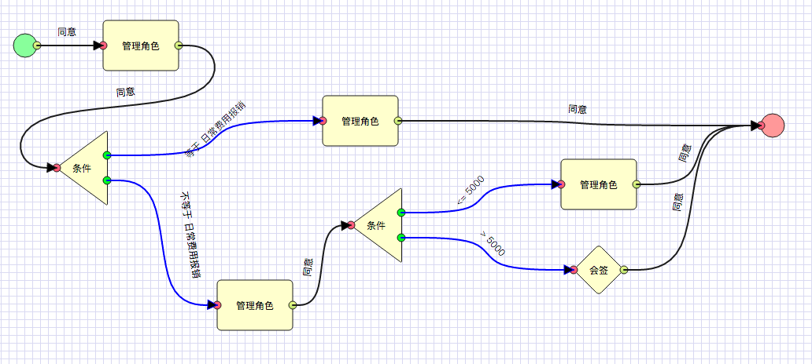

# workflow-designer-web

代码修改, 以适应 `审批流程` 编辑,作为审批流程设计器使用.

### 模型组成:

审批模型支持的概念有3, 分别是:

#### 审批节点

- 固定人员审批节点
- 部门主管审批节点
- 自由选择审批节点 ( 自由流 )

#### 审批条件

- 针对单据某字段
- 针对当前单据审批状态

#### 会签

- 全部完成型
- 任意完成型

### 图示：

